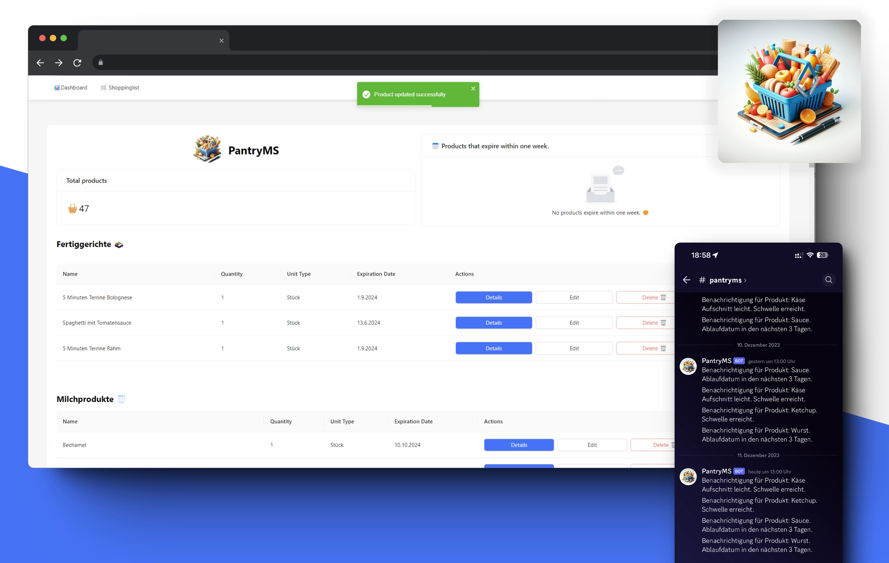

# PantryMS - Internal Food Management System

PantryMS is a web-based system designed for efficiently managing food items, keeping track of inventory, and providing notifications for low-stock or expiring products. The system allows for the organization of food items into different categories and integrates Discord webhooks for timely notifications.

## Key Features:

-   **Product Management:** Add new products, update existing information, and remove items that are no longer needed.
-   **Categories:** Organize products into predefined categories for a streamlined structure.
-   **Expiration Date Monitoring:** Receive alerts for products that are nearing expiration to minimize food waste.
-   **Low-on-Stock Notifications:** Get notifications for products with low inventory to facilitate timely restocking.
-   **Discord Integration:** Connect PantryMS with Discord webhooks for real-time notifications. (via Backend!!)
-   **EAN Scanner Integration:** Simplify product addition by seamlessly integrating EAN scanners, enhancing the efficiency of the system.

## Prerequisites:

To use PantryMS, ensure the following:

-   A MySQL database is available (for the backend)
-   PantryMS backend is set up. (Currently working on packaging the entire system into a Docker container.)

## Docker Setup:

For an easy deployment, PantryMS provides a ready-to-use Docker version. Follow these steps:

1.  **Frontend Docker Setup:**
    
    -   Download the frontend Docker container:
        
        `docker pull wiesty/pantrymsfrontend:latest` 
        
    -   Set the following environment variable while running the frontend Docker container:
        
        `REACT_APP_PantryMS_Backend=<your_backend_api_url>` 
        
        example: http://192.168.123.49:3001/api/
        
2.  **Backend Docker Setup:**
    
    -   Backend Docker setup and installation can be found [here](https://github.com/wiesty/PantryMS-Backend). 

**Disclaimer:** Please note that PantryMS is a hobby project, and as such, I'm unable to provide extensive support. I appreciate your understanding and encourage you to explore and enjoy the system at your own pace. If you encounter any issues, feel free to reach out, and I'll do my best to assist when time permits.

Happy managing with PantryMS!

